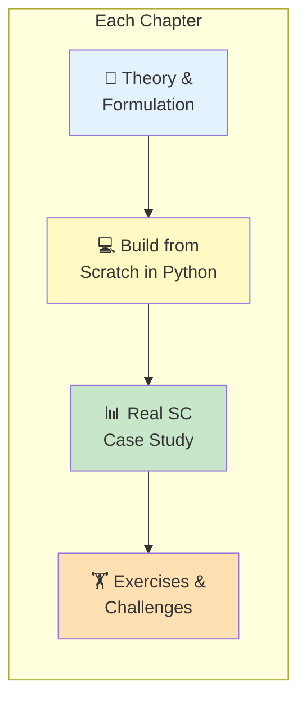

# 🔧 Supply Chain Optimization from Scratch

<p align="center">
  
  
  
  
</p>

> **Build supply chain optimization models from zero — no hand-waving, pure implementation.**

<p align="center">
  <em>Implement every major optimization technique used in supply chain management, step by step in Python.</em>
</p>

---

## 🌟 Why This Book/Course?

Most supply chain professionals use optimization tools as **black boxes**. They know the software gives an answer, but they don't understand *why* — which means they can't debug, customize, or trust the results.

This course changes that. We build **every optimization model from scratch** in Python:

- 📐 **Linear Programming** — from the simplex method to real transportation problems
- 🔢 **Integer Programming** — facility location, production scheduling, lot sizing
- 📦 **Inventory Models** — EOQ, newsvendor, (s,S) policies, multi-echelon
- 🌐 **Network Design** — where to put warehouses, which suppliers to use
- 🚚 **Vehicle Routing** — the famous VRP and its many real-world variants
- 🎲 **Stochastic Optimization** — making decisions under uncertainty
- ⚖️ **Multi-Objective** — balancing cost vs. service vs. sustainability

> *"The person who understands the model understands the limits of the answer. The person who just runs the software trusts a number they shouldn't."*

---

## 📚 Chapters

| Chapter | Title | Topic | Notebook |
|---------|-------|-------|----------|
| CH01 | [The Optimization Mindset](./ch01/README.md) | Formulating supply chain problems as mathematical optimization models | [Open](./ch01/notebook.ipynb) |
| CH02 | [Linear Programming for SC](./ch02/README.md) | Solving transportation, assignment, and network flow problems with LP | [Open](./ch02/notebook.ipynb) |
| CH03 | [Integer & Mixed-Integer Programming](./ch03/README.md) | Production scheduling, facility location, and lot sizing with MIP | [Open](./ch03/notebook.ipynb) |
| CH04 | [Inventory Optimization Models](./ch04/README.md) | EOQ, newsvendor, base-stock, and multi-echelon inventory models | [Open](./ch04/notebook.ipynb) |
| CH05 | [Network Design Optimization](./ch05/README.md) | Facility location, capacity planning, and supply chain network design | [Open](./ch05/notebook.ipynb) |
| CH06 | [Vehicle Routing & Logistics](./ch06/README.md) | VRP variants: CVRP, VRPTW, PDPTW with exact and heuristic methods | [Open](./ch06/notebook.ipynb) |
| CH07 | [Stochastic Optimization](./ch07/README.md) | Uncertainty modeling: stochastic programming, robust optimization, simulation | [Open](./ch07/notebook.ipynb) |
| CH08 | [Multi-Objective Optimization](./ch08/README.md) | Balancing cost, service, sustainability, and resilience simultaneously | [Open](./ch08/notebook.ipynb) |
| CH09 | [Metaheuristics for SC](./ch09/README.md) | Genetic algorithms, simulated annealing, tabu search for complex SC problems | [Open](./ch09/notebook.ipynb) |
| CH10 | [Production to Deployment](./ch10/README.md) | Operationalizing optimization models: APIs, monitoring, and maintenance | [Open](./ch10/notebook.ipynb) |


---

## 🏗️ How This Course Works



Each chapter follows the same pattern:
1. **Theory** — The mathematical formulation, explained intuitively
2. **Build** — Implement the solver in pure Python (then compare to scipy/PuLP)
3. **Apply** — Solve a realistic supply chain case study
4. **Practice** — Exercises from easy to competition-level

---

## 🚀 Getting Started

```bash
git clone https://github.com/virbahu/supply-chain-optimization-from-scratch.git
cd supply-chain-optimization-from-scratch
pip install -r requirements.txt
jupyter notebook
```


---

## 👤 Author

**Virbahu Jain** — Founder & CEO, [Quantisage](https://quantisage.com)

> Building the AI Operating System for Scope 3 emissions management and supply chain decarbonization.

| | |
|---|---|
| 🎓 **Education** | MBA, Kellogg School of Management, Northwestern University |
| 🏭 **Experience** | 20+ years across manufacturing, life sciences, energy & public sector |
| 🌍 **Scope** | Supply chain operations on five continents |

---

## ⭐ Star History

If you find this useful, please **⭐ star this repo** — it helps others discover it!

## 📄 License

MIT License — see [LICENSE](LICENSE) for details.

<p align="center">
  <sub>Part of the <b>Quantisage Open Source Initiative</b> | AI × Supply Chain × Climate</sub>
</p>
